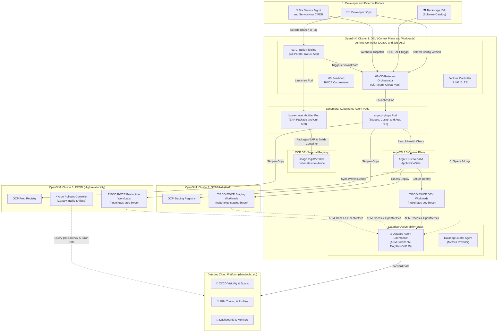
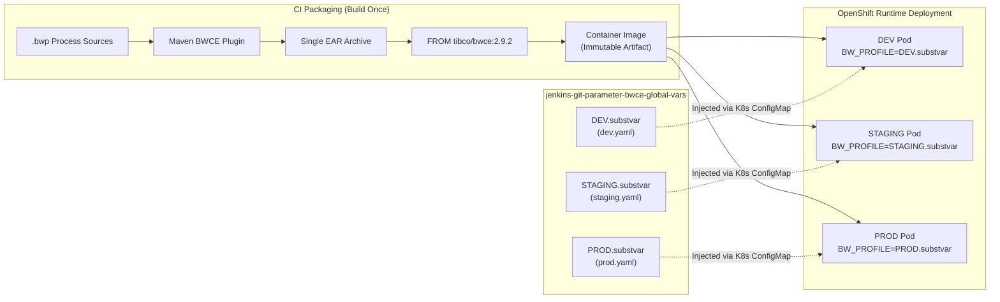
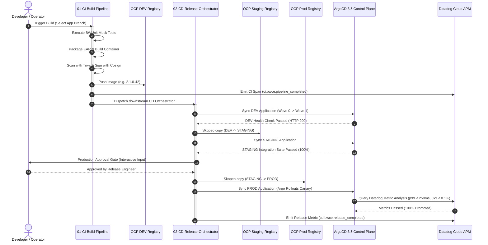

# 🚀 Enterprise TIBCO BWCE Multi-Cluster GitOps Platform with Datadog Observability

[](https://docs.tibco.com/)
[](https://www.datadoghq.com/)
[](https://www.jenkins.io/)
[](https://argo-cd.readthedocs.io/)
[](https://www.redhat.com/openshift)
[](https://slsa.dev/)

An enterprise-grade, multi-cluster continuous integration and progressive delivery platform purpose-built for **TIBCO BusinessWorks™ Container Edition (BWCE 2.9.2 / 2.10.0)** microservices on **Red Hat OpenShift 4.20+**. It integrates **Jenkins Configuration as Code (JCasC)**, **Dynamic Git Parameter Plugin Dropdowns**, **Multi-Remote SCM**, **ArgoCD 3.5 Multi-Cluster GitOps**, and **Datadog Full-Stack Observability** (APM, DogStatsD, CI Visibility, Logs, and Argo Rollouts Metric Analysis).

---

## 📑 Table of Contents
- [Executive Summary & Architecture Overview](#executive-summary--architecture-overview)
- [TIBCO BWCE Cloud-Native Best Practices](#tibco-bwce-cloud-native-best-practices)
  - [1. 12-Factor Profile Externalization via `.substvar`](#1-12-factor-profile-externalization-via-substvar)
  - [2. Engine Sizing & Performance Tuning](#2-engine-sizing--performance-tuning)
  - [3. OpenShift Hardening & Health Probing](#3-openshift-hardening--health-probing)
- [Datadog Full-Stack Observability Architecture](#datadog-full-stack-observability-architecture)
  - [1. Jenkins CI/CD Visibility Plugin](#1-jenkins-cicd-visibility-plugin)
  - [2. TIBCO BWCE Java APM Tracer & DogStatsD](#2-tibco-bwce-java-apm-tracer--dogstatsd)
  - [3. Datadog Live Dashboards & Monitors](#3-datadog-live-dashboards--monitors)
  - [4. Argo Rollouts Progressive Delivery with Datadog Metric Analysis](#4-argo-rollouts-progressive-delivery-with-datadog-metric-analysis)
- [Multi-Repository Git Parameter CI/CD Patterns](#multi-repository-git-parameter-cicd-patterns)
  - [Pattern 1: Dual Git Parameter Dropdowns (Multi-Remote SCM)](#pattern-1-dual-git-parameter-dropdowns-multi-remote-scm)
  - [Pattern 2: Decoupled CI Build & Multi-Cluster CD Orchestrator](#pattern-2-decoupled-ci-build--multi-cluster-cd-orchestrator)
- [Repository Structure](#repository-structure)
- [Quick Start & Deployment](#quick-start--deployment)
- [Decommissioning & Reinstallation](#decommissioning--reinstallation)
- [References & Standards](#references--standards)

---

## Executive Summary & Architecture Overview

This solution addresses a primary enterprise modernization requirement: **how to build, govern, promote, and release TIBCO BWCE microservices across 3 distinct OpenShift clusters (DEV, STAGING, PROD) while leveraging dynamic Git Parameter selection, Declarative Pipelines as Code, ArgoCD 3.5 GitOps synchronization, and native Datadog APM & CI visibility.**

<details open>
<summary>🗺️ <b>Click to expand: End-to-End Multi-Cluster Platform Topology Diagram</b></summary>
<br/>



</details>

---

## TIBCO BWCE Cloud-Native Best Practices

### 1. 12-Factor Profile Externalization via `.substvar`
In enterprise TIBCO BWCE implementations, building environment-specific EAR files violates 12-Factor principles. Instead:
- **Build Once**: A single immutable `.ear` artifact (`tibco-bwce-order-service_2.1.0.ear`) is generated during CI and embedded into the container image (`FROM tibco/bwce:2.9.2`).
- **Externalize Profiles**: Configuration files (`DEV.substvar`, `STAGING.substvar`, `PROD.substvar`) reside in the Single Source of Truth configuration repository: [`jenkins-git-parameter-bwce-global-vars`](https://github.com/nubenetes/jenkins-git-parameter-bwce-global-vars).
- **Runtime Injection**: The runtime profile is selected via `BW_PROFILE` environment variable or ConfigMap volume mount at startup.

<details>
<summary>⚙️ <b>Click to expand: TIBCO BWCE Profile Externalization Flow Diagram</b></summary>
<br/>



</details>

---

### 2. Engine Sizing & Performance Tuning
The BusinessWorks Container Edition runtime engine requires deliberate sizing parameters adapted to container cgroups:

| Environment | Replicas | CPU Req/Lim | Memory Req/Lim | `BW_ENGINE_THREADCOUNT` | `BW_STEP_FLOWLIMIT` | `BW_LOGLEVEL` |
| :--- | :--- | :--- | :--- | :--- | :--- | :--- |
| **DEV** | 2 | 250m / 1000m | 512Mi / 1024Mi | `16` | `50` | `DEBUG` |
| **STAGING** | 3 | 500m / 1500m | 768Mi / 1536Mi | `32` | `100` | `INFO` |
| **PROD** | 6 | 1000m / 2000m | 1024Mi / 2048Mi | `64` | `250` | `WARN` |

- **`BW_ENGINE_THREADCOUNT`**: Specifies the number of engine worker threads executing process instances concurrently.
- **`BW_STEP_FLOWLIMIT`**: Prevents unbounded memory growth during traffic bursts by capping active in-memory process transitions.
- **`BW_CONTAINER_SHUTDOWN_TIMEOUT_SECONDS`**: Set to `30s` (DEV/STAGING) and `45s` (PROD) for clean process draining upon `SIGTERM`.
- **JVM Options**: `-XX:+UseContainerSupport -XX:MaxRAMPercentage=75.0 -XX:+UseG1GC -XX:+ExplicitGCInvokesConcurrent` ensuring GC predictability inside Linux container cgroups.

---

### 3. OpenShift Hardening & Health Probing
- **Security Context Constraints**: Complies with OpenShift `restricted-v2` SCC (non-root `uid: 1001`, dropped capabilities `ALL`, read-only root filesystems).
- **Probes**:
  - **Liveness Probe**: `HTTP GET http://:8090/health` (Initial delay: `45s`, Period: `15s`, Timeout: `5s`).
  - **Readiness Probe**: `HTTP GET http://:8090/health` (Initial delay: `20s`, Period: `10s`, Timeout: `3s`).

---

## Datadog Full-Stack Observability Architecture

Replaces OpenTelemetry and Grafana with an enterprise **Datadog** observability stack.

```mermaid
flowchart TD
    subgraph CI_Layer ["1. CI/CD Pipeline Visibility"]
        JenkinsCtrl["🚀 Jenkins Controller<br/>(Datadog Plugin 5.9.0)"] -->|Pipeline Spans & Traces| DDAgentNode["🐶 Datadog Agent<br/>(DaemonSet Port 8125 / 8126)"]
    end

    subgraph App_Layer ["2. BWCE Application APM & Metrics"]
        BWCEApp["📦 TIBCO BWCE Order Service<br/>(-javaagent:dd-java-agent.jar)"] -->|APM HTTP/JMS Spans (8126)| DDAgentNode
        BWCEApp -->|OpenMetrics & Thread Pools (8090)| DDAgentNode
        BWCEApp -->|Container Logs (JSON)| DDAgentNode
    end

    subgraph Delivery_Layer ["3. Progressive Delivery Validation"]
        RolloutEngine["⚡ Argo Rollouts<br/>(Canary Promotion)"] -->|Queries Metrics API| DDCloudBackend["🐶 Datadog Cloud Platform<br/>(datadoghq.eu)"]
    end

    DDAgentNode -->|Encrypted HTTPS (Port 443)| DDCloudBackend
    DDCloudBackend -->|Visualizes| LiveDash["📊 Datadog Dashboards<br/>• Jenkins CI Visibility<br/>• BWCE Engine Performance<br/>• ArgoCD GitOps Sync"]
    DDCloudBackend -->|Alerts| AlertMon["🚨 Datadog Monitors<br/>(Slack / PagerDuty)"]
```

---

### 1. Jenkins CI/CD Visibility Plugin
The official Datadog Jenkins Plugin (`datadog:5.9.0`) is configured via JCasC (`jcasc/jenkins-jcasc.yaml`):
- Automatically correlates pipeline builds, stage execution times, agent queue wait times, and test results.
- Injects Datadog Trace IDs (`x-datadog-trace-id`) across pipeline steps.
- Global tags: `env:dev`, `team:integration-platform`, `tech:tibco-bwce`, `cluster:ocp-dev`.

### 2. TIBCO BWCE Java APM Tracer & DogStatsD
- **Java Tracer**: The Datadog Java APM agent (`dd-java-agent.jar`) is injected into the container image and attached to the BWCE engine via:
  ```bash
  BW_JAVA_OPTS="-XX:+UseContainerSupport -XX:MaxRAMPercentage=75.0 -XX:+UseG1GC -javaagent:/opt/datadog/dd-java-agent.jar -Ddd.service=tibco-bwce-order-service -Ddd.logs.injection=true -Ddd.profiling.enabled=true"
  ```
- **OpenMetrics Autodiscovery**: Pod annotations configure the Datadog Agent to scrape BWCE management metrics from port `8090`:
  ```yaml
  annotations:
    ad.datadoghq.com/tibco-bwce-order-service.logs: '[{"source": "tibco-bwce", "service": "tibco-bwce-order-service"}]'
    ad.datadoghq.com/tibco-bwce-order-service.check_names: '["openmetrics"]'
    ad.datadoghq.com/tibco-bwce-order-service.init_configs: '[{}]'
    ad.datadoghq.com/tibco-bwce-order-service.instances: |
      [{"openmetrics_endpoint": "http://%%host%%:8090/metrics", "namespace": "tibco_bwce", "metrics": [".*"]}]
  ```

### 3. Datadog Live Dashboards & Monitors
Preconfigured Datadog JSON dashboards and alert monitors located in [`observability/`](observability/):
- **Jenkins CI Visibility**: [`observability/dashboards/datadog-jenkins-ci-visibility.json`](observability/dashboards/datadog-jenkins-ci-visibility.json)
- **BWCE Engine Performance**: [`observability/dashboards/datadog-bwce-runtime-performance.json`](observability/dashboards/datadog-bwce-runtime-performance.json)
- **ArgoCD GitOps Sync**: [`observability/dashboards/datadog-argocd-gitops-sync.json`](observability/dashboards/datadog-argocd-gitops-sync.json)
- **Automated Monitors**: [`observability/monitors/datadog-monitors-bwce.yaml`](observability/monitors/datadog-monitors-bwce.yaml) (Monitors HTTP 5xx error rate > 1%, p99 latency > 500ms, and build agent queue bottlenecks).

### 4. Argo Rollouts Progressive Delivery with Datadog Metric Analysis
During canary deployments, Argo Rollouts queries Datadog metrics directly using [`sample-apps/tibco-bwce-order-service/rollout/analysis-template-datadog.yaml`](sample-apps/tibco-bwce-order-service/rollout/analysis-template-datadog.yaml):
- **Error Rate SLA**: Evaluates that 5xx errors $\le 0.1\%$ via `sum:trace.tibco_bwce_order_service.request.errors{env:prod}.as_count() / sum:trace.tibco_bwce_order_service.request.hits{env:prod}.as_count()`.
- **Latency SLA**: Evaluates that p99 latency $\le 250	ext{ms}$ via `p99:trace.tibco_bwce_order_service.request.duration{env:prod}` before traffic step promotion.

---

## Multi-Repository Git Parameter CI/CD Patterns

### Pattern 1: Dual Git Parameter Dropdowns (Multi-Remote SCM)
*Target: Developer Sandboxes & Feature Preview Environments*
- **Dropdown 1**: Queries application repository (`APP_GIT_REVISION`).
- **Dropdown 2**: Queries global configuration repository (`GLOBAL_VARS_REVISION`).
- Multi-remote refspecs configured via Job DSL in [`jobdsl/pipelines-ci.groovy`](jobdsl/pipelines-ci.groovy).

### Pattern 2: Decoupled CI Build & Multi-Cluster CD Orchestrator
*Target: Enterprise Production Release Pipeline (Recommended)*

<details>
<summary>🔄 <b>Click to expand: End-to-End Hand-off Sequence Diagram</b></summary>
<br/>



</details>

---

## 📂 Repository Structure

```
.
├── config/
│   ├── environments.env              # Pinned versions, domain names, Datadog credentials
│   └── clusters.yaml                 # ConfigMap defining OCP DEV, STAGING, PROD topologies
├── helm/
│   ├── jenkins/                      # Official Jenkins chart values with Datadog plugin
│   ├── observability/                # Datadog Agent Helm values (OpenShift hardened)
│   └── argocd/                       # ArgoCD 3.5 Helm values
├── jcasc/
│   ├── jenkins-jcasc.yaml            # JCasC security matrix, Datadog CI visibility, seed job
│   ├── pod-templates.yaml            # Ephemeral Kubernetes agent pod templates (bwce-builder)
│   └── github-app-credentials.yaml   # GitHub App credential rotation
├── jobdsl/
│   ├── seed-job.groovy               # Master Seed Job definition
│   ├── pipelines-ci.groovy           # Pattern 1 and Pattern 2 CI pipelines
│   └── pipelines-cd.groovy           # CD Release Orchestrator & Hotfix pipelines
├── jenkinsfiles/
│   ├── ci/
│   │   ├── Jenkinsfile.app-bwce
│   │   └── Jenkinsfile.app-bwce-dual-dropdown
│   └── cd/
│       ├── Jenkinsfile.release-orchestrator
│       └── Jenkinsfile.hotfix-deploy
├── shared-library/
│   ├── vars/
│   │   ├── datadogLogEvent.groovy    # Emits Datadog CI spans & DogStatsD metrics
│   │   ├── bwceEarBuild.groovy       # Compiles and packages BWCE EAR
│   │   ├── bwceProfileOverride.groovy# Injects .substvar profile tokens
│   │   ├── argoAppSync.groovy        # ArgoCD 3.5 synchronization
│   │   ├── skopeoPromote.groovy      # Cross-cluster image promotion
│   │   ├── cosignSign.groovy         # Cryptographic image signing (SLSA Level 3)
│   │   ├── sbomGenerate.groovy       # CycloneDX SBOM generation
│   │   └── gitopsCommit.groovy       # Updates Global Vars SSOT repository
│   └── src/com/nubenetes/gitops/
├── sample-apps/
│   ├── tibco-bwce-order-service/     # Complete TIBCO BWCE project + Dockerfile + K8s + Rollout
│   └── tibco-bwce-customer-api/
├── observability/
│   ├── dashboards/                   # Datadog dashboards (Jenkins, BWCE Engine, ArgoCD)
│   └── monitors/                     # Datadog automated alert monitors
├── argocd-apps/                      # ArgoCD Root App-of-Apps & ApplicationSets
├── security/                         # Image signature policy & External Secrets Operator
├── scripts/                          # Automation & setup scripts
├── deploy.sh                         # 1-Click Platform Deployment Script
├── destroy.sh                        # Clean Decommission Script
├── reinstall.sh                      # Full Wipe & Reinstall Script
└── Makefile
```

---

## 🚀 Quick Start & Deployment

### 1. Prerequisites
- Red Hat OpenShift 4.20+ cluster (or Kubernetes 1.31+)
- `kubectl`, `oc`, and `helm` v3 CLI tools installed
- Datadog Account & API/App Keys

### 2. Configure Credentials
Set your Datadog credentials in `config/environments.env` or export environment variables:
```bash
export DATADOG_API_KEY="your-datadog-api-key"
export DATADOG_APP_KEY="your-datadog-app-key"
```

### 3. Deploy Platform
```bash
./deploy.sh
# or
make deploy
```

### 4. Access Platform Services
- **Jenkins Controller**: `https://jenkins-jenkins.apps.ocp-dev.nubenetes.internal` (Default login: `admin` / `admin123!`)
- **ArgoCD UI**: `https://argocd-server.apps.ocp-dev.nubenetes.internal`
- **Datadog Dashboard**: `https://app.datadoghq.eu`

---

## 🔗 Related Repositories
- **Global Variables SSOT**: [jenkins-git-parameter-bwce-global-vars](https://github.com/nubenetes/jenkins-git-parameter-bwce-global-vars)
