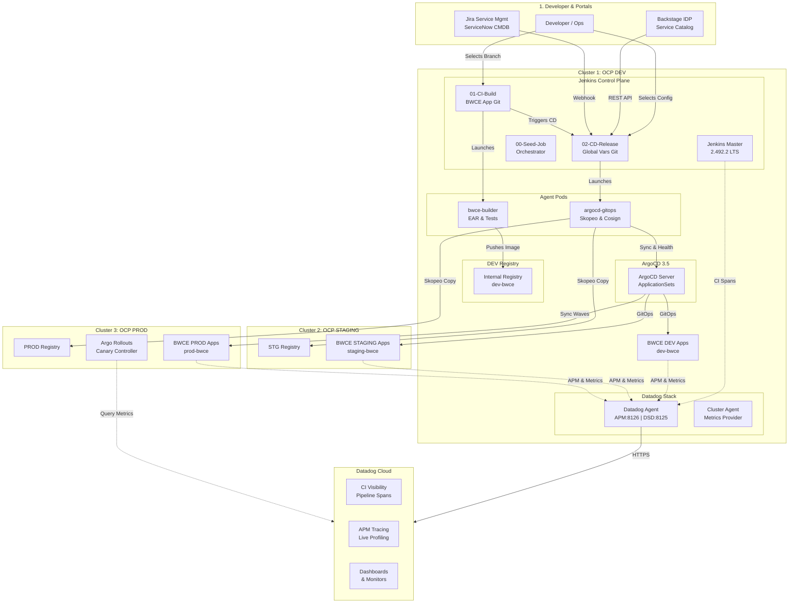
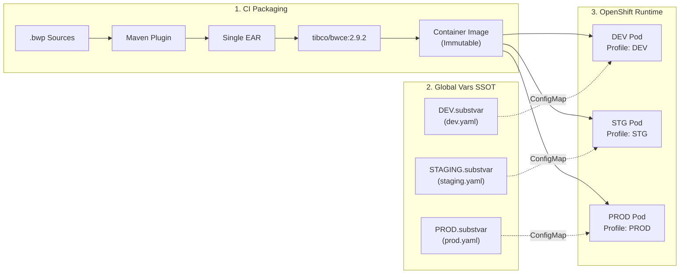
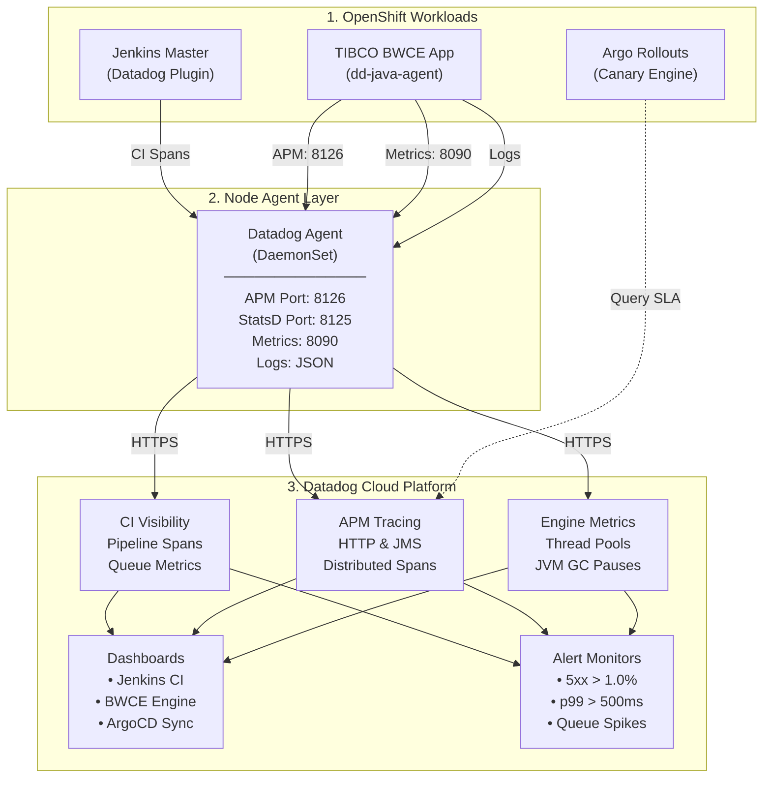
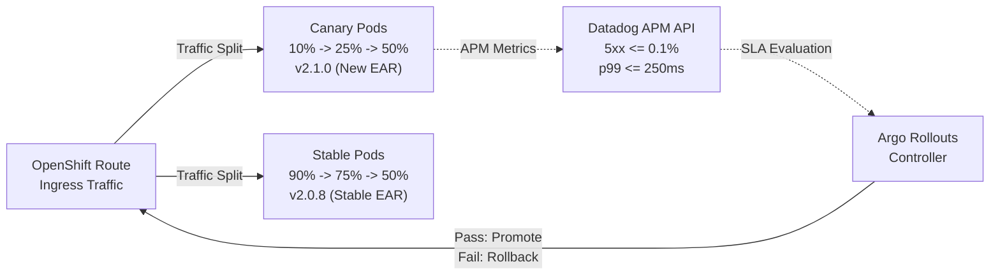
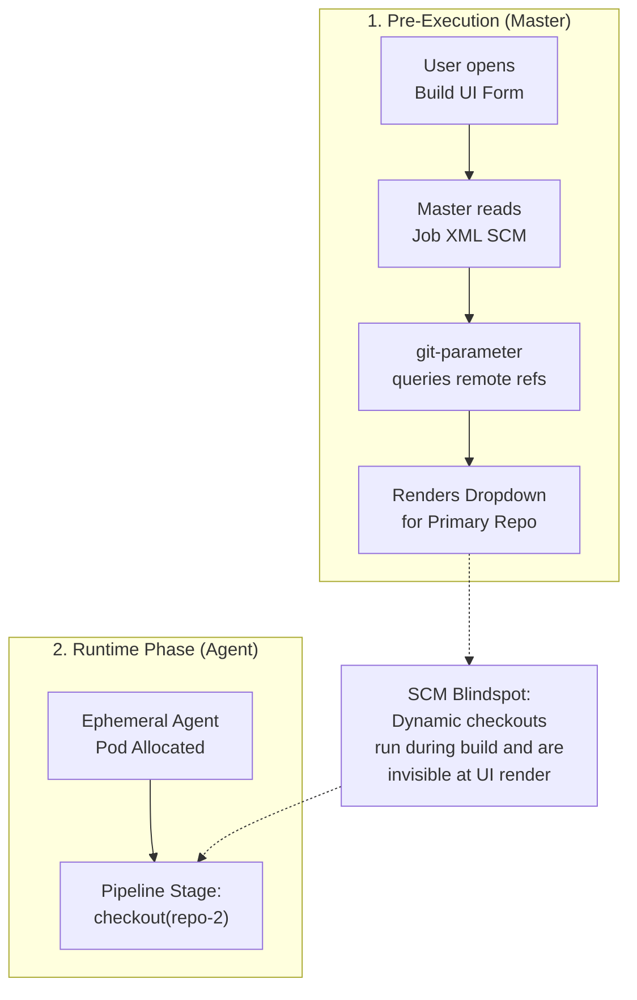
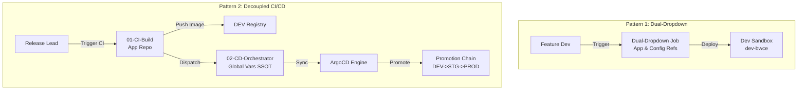
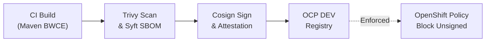
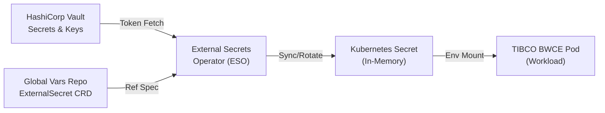
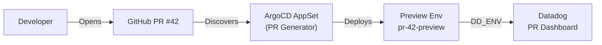

# 🚀 Enterprise TIBCO BWCE Multi-Cluster GitOps Platform with Datadog Observability

[](#)
[](https://docs.tibco.com/)
[](https://www.datadoghq.com/)
[](https://www.jenkins.io/)
[](https://argo-cd.readthedocs.io/)
[](https://argoproj.github.io/argo-rollouts/)
[](https://www.redhat.com/openshift)
[](https://kubernetes.io/)
[](https://www.jenkins.io/projects/jcasc/)
[](https://slsa.dev/)
[](https://docs.sigstore.dev/cosign/overview/)
[](https://cyclonedx.org/)
[](https://aquasecurity.github.io/trivy/)
[](https://external-secrets.io/)
[](https://12factor.net/)
[](LICENSE)

An enterprise-grade, multi-cluster continuous integration and progressive delivery platform purpose-built for **TIBCO BusinessWorks™ Container Edition (BWCE 2.9.2 / 2.10.0)** microservices on **Red Hat OpenShift 4.20+**. It integrates **Jenkins Configuration as Code (JCasC)**, **Dynamic Git Parameter Plugin Dropdowns**, **Multi-Remote SCM**, **ArgoCD 3.5 Multi-Cluster GitOps**, and **Datadog Full-Stack Observability** (APM, DogStatsD, CI Visibility, Logs, and Argo Rollouts Metric Analysis).

---

> [!IMPORTANT]
> ### ⚠️ Architectural Blueprint & Sovereign Environment Notice
> - **Non-Production Testing Status**: This repository serves as an **architectural reference blueprint, educational design pattern, and foundational boilerplate**. It has **not been tested or executed in a live production environment**.
> - **Sovereign & Air-Gapped Boilerplate**: This project is engineered as a deterministic, version-controlled Infrastructure-as-Code (IaC) template that can be safely used as a **standardized boilerplate in enterprise environments where Agentic AI / LLMs are prohibited** due to data sovereignty, compliance regulations, intellectual property protection, or air-gapped security policies.
> - **Enterprise Hardening**: Platform engineers must review, adapt, and validate all cluster endpoints, TLS certificates, HashiCorp Vault configurations, Datadog API keys, and RBAC quotas prior to production adoption.
> - **AI Generation Attribution**: This architecture, Infrastructure-as-Code implementation, and documentation were generated using **Gemini 3.7 Flash** with **Antigravity**.
> - **Origin & Real-World Heritage**: This blueprint is based on [nubenetes/jenkins-git-parameter](https://github.com/nubenetes/jenkins-git-parameter) and [nubenetes/jenkins-git-parameter-global-vars](https://github.com/nubenetes/jenkins-git-parameter-global-vars), drawing directly from the author's personal hands-on experience designing and operating enterprise integration platforms with these exact requirements (engineered just before agentic AI became widespread).

---

## 📑 Table of Contents
- [Executive Summary & Architecture Overview](#executive-summary--architecture-overview)
- [TIBCO BWCE Cloud-Native Best Practices](#tibco-bwce-cloud-native-best-practices)
  - [1. 12-Factor Profile Externalization via `.substvar`](#1-12-factor-profile-externalization-via-substvar)
  - [2. Engine Sizing & Performance Tuning](#2-engine-sizing--performance-tuning)
  - [3. OpenShift Hardening & Health Probing](#3-openshift-hardening--health-probing)
- [Datadog Full-Stack Observability Architecture](#datadog-full-stack-observability-architecture)
  - [1. Jenkins CI/CD Visibility Plugin](#1-jenkins-cicd-visibility-plugin)
  - [2. TIBCO BWCE Java APM Tracer & DogStatsD](#2-tibco-bwce-java-apm-tracer--dogstatsd)
  - [3. Datadog Live Dashboards & Monitors](#3-datadog-live-dashboards--monitors)
  - [4. Progressive Delivery with Argo Rollouts & Datadog Metrics SLA](#4-progressive-delivery-with-argo-rollouts--datadog-metrics-sla)
- [Multi-Repository Git Parameter CI/CD Patterns](#multi-repository-git-parameter-cicd-patterns)
  - [Pattern 1: Dual Git Parameter Dropdowns (Multi-Remote SCM)](#pattern-1-dual-git-parameter-dropdowns-multi-remote-scm)
  - [Pattern 2: Decoupled CI Build & Multi-Cluster CD Orchestrator](#pattern-2-decoupled-ci-build--multi-cluster-cd-orchestrator)
- [Enterprise Security & Supply Chain Integrity](#enterprise-security--supply-chain-integrity)
  - [1. Cosign Image Signing & SLSA Level 3 Attestation](#1-cosign-image-signing--slsa-level-3-attestation)
  - [2. Zero-Trust Secrets with External Secrets Operator & Vault](#2-zero-trust-secrets-with-external-secrets-operator--vault)
  - [3. Ephemeral PR Preview Environments via ArgoCD ApplicationSets](#3-ephemeral-pr-preview-environments-via-argocd-applicationsets)
- [Repository Structure](#repository-structure)
- [Quick Start & Deployment](#quick-start--deployment)
- [Decommissioning & Reinstallation](#decommissioning--reinstallation)
- [References & Standards](#references--standards)

---

## Executive Summary & Architecture Overview

This platform delivers an automated, governed, multi-cluster CI/CD and GitOps delivery pipeline for enterprise TIBCO BWCE workloads across three OpenShift clusters (DEV, STAGING, PROD).

<details>
<summary>🗺️ <b>Click to expand: End-to-End Multi-Cluster Platform Topology Diagram</b></summary>
<br/>



</details>

---

## TIBCO BWCE Cloud-Native Best Practices

### 1. 12-Factor Profile Externalization via `.substvar`
In enterprise TIBCO BWCE implementations, building environment-specific EAR files violates 12-Factor principles. Instead:
- **Build Once**: A single immutable `.ear` artifact (`tibco-bwce-order-service_2.1.0.ear`) is compiled during CI and packaged into the container image (`FROM tibco/bwce:2.9.2`).
- **Externalize Profiles**: Configuration tokens (`DEV.substvar`, `STAGING.substvar`, `PROD.substvar`) reside in the Single Source of Truth configuration repository: [`jenkins-git-parameter-bwce-global-vars`](https://github.com/nubenetes/jenkins-git-parameter-bwce-global-vars).
- **Runtime Injection**: The runtime profile is selected via `BW_PROFILE` environment variable or ConfigMap volume mount at container startup.

<details>
<summary>⚙️ <b>Click to expand: TIBCO BWCE Profile Externalization Flow Diagram</b></summary>
<br/>



</details>

---

### 2. Engine Sizing & Performance Tuning
The BusinessWorks Container Edition runtime engine requires deliberate sizing parameters adapted to container cgroups:

| Environment | Replicas | CPU Request (Burstable) | Memory Req / Limit | `BW_ENGINE_THREADCOUNT` | `BW_STEP_FLOWLIMIT` | `BW_LOGLEVEL` |
| :--- | :--- | :--- | :--- | :--- | :--- | :--- |
| **DEV** | 2 | `250m` (No CPU Limit) | 512Mi / 1024Mi | `16` | `50` | `DEBUG` |
| **STAGING** | 3 | `500m` (No CPU Limit) | 768Mi / 1536Mi | `32` | `100` | `INFO` |
| **PROD** | 6 | `1000m` (No CPU Limit) | 1024Mi / 2048Mi | `64` | `250` | `WARN` |

> [!TIP]
> #### 💡 Why CPU Limits are Omitted at the Pod Level (Preventing Linux CFS Bandwidth Throttling)
> - **The CFS Quota Problem in Multi-Threaded Runtimes**: Setting `resources.limits.cpu` instructs the Linux kernel Completely Fair Scheduler (CFS) to enforce hard bandwidth quotas (`cfs_quota_us` over 100ms periods). Because TIBCO BWCE and JVM garbage collection are highly concurrent (e.g. 16–64 engine threads), parallel thread execution can consume the quota in milliseconds, causing the container to be **hard-throttled for the remainder of the period**. This induces artificial p99 latency spikes and timeouts even when the OpenShift worker node has surplus CPU capacity.
> - **Namespace-Level ResourceQuota Governance**: Instead of per-pod CPU limits, capacity governance and noisy-neighbor protection are enforced at the **OpenShift Project/Namespace boundary** using [`security/openshift-namespace-resource-quota.yaml`](security/openshift-namespace-resource-quota.yaml) (`ResourceQuota` for aggregate `requests.cpu`, `requests.memory`, and `limits.memory`).
> - **Deterministic Memory Limits**: Unlike CPU (which is compressible), Memory is strictly capped with `limits.memory` to prevent out-of-memory cascading to neighbor pods.

- **`BW_ENGINE_THREADCOUNT`**: Specifies the number of engine worker threads executing process instances concurrently.
- **`BW_STEP_FLOWLIMIT`**: Prevents unbounded memory growth during traffic bursts by capping active in-memory process transitions.
- **`BW_CONTAINER_SHUTDOWN_TIMEOUT_SECONDS`**: Set to `30s` (DEV/STAGING) and `45s` (PROD) for clean process draining upon `SIGTERM`.
- **JVM Options**: `-XX:+UseContainerSupport -XX:MaxRAMPercentage=75.0 -XX:+UseG1GC -XX:+ExplicitGCInvokesConcurrent` ensuring GC predictability inside Linux container cgroups.

---

### 3. OpenShift Hardening & Health Probing
- **Security Context Constraints**: Complies with OpenShift `restricted-v2` SCC (non-root `uid: 1001`, dropped capabilities `ALL`, read-only root filesystems).
- **Probes**:
  - **Liveness Probe**: `HTTP GET http://:8090/health` (Initial delay: `45s`, Period: `15s`, Timeout: `5s`).
  - **Readiness Probe**: `HTTP GET http://:8090/health` (Initial delay: `20s`, Period: `10s`, Timeout: `3s`).

---

## Datadog Full-Stack Observability Architecture

Replaces OpenTelemetry and Grafana with an enterprise **Datadog** observability stack.

<details>
<summary>📊 <b>Click to expand: Datadog Full-Stack Observability Architecture Diagram</b></summary>
<br/>



</details>

---

### 1. Jenkins CI/CD Visibility Plugin
The official Datadog Jenkins Plugin (`datadog:5.9.0`) is configured via JCasC (`jcasc/jenkins-jcasc.yaml`):
- Automatically correlates pipeline builds, stage execution times, agent queue wait times, and test results.
- Injects Datadog Trace IDs (`x-datadog-trace-id`) across pipeline steps.
- Global tags: `env:dev`, `team:integration-platform`, `tech:tibco-bwce`, `cluster:ocp-dev`.

### 2. TIBCO BWCE Java APM Tracer & DogStatsD
- **Java Tracer**: The Datadog Java APM agent (`dd-java-agent.jar`) is injected into the container image and attached to the BWCE engine via:
  ```bash
  BW_JAVA_OPTS="-XX:+UseContainerSupport -XX:MaxRAMPercentage=75.0 -XX:+UseG1GC -javaagent:/opt/datadog/dd-java-agent.jar -Ddd.service=tibco-bwce-order-service -Ddd.logs.injection=true -Ddd.profiling.enabled=true"
  ```
- **OpenMetrics Autodiscovery**: Pod annotations configure the Datadog Agent to scrape BWCE management metrics from port `8090`:
  ```yaml
  annotations:
    ad.datadoghq.com/tibco-bwce-order-service.logs: '[{"source": "tibco-bwce", "service": "tibco-bwce-order-service"}]'
    ad.datadoghq.com/tibco-bwce-order-service.check_names: '["openmetrics"]'
    ad.datadoghq.com/tibco-bwce-order-service.init_configs: '[{}]'
    ad.datadoghq.com/tibco-bwce-order-service.instances: |
      [{"openmetrics_endpoint": "http://%%host%%:8090/metrics", "namespace": "tibco_bwce", "metrics": [".*"]}]
  ```

### 3. Datadog Live Dashboards & Monitors
Preconfigured Datadog JSON dashboards and alert monitors located in [`observability/`](observability/):
- **Jenkins CI Visibility**: [`observability/dashboards/datadog-jenkins-ci-visibility.json`](observability/dashboards/datadog-jenkins-ci-visibility.json)
- **BWCE Engine Performance**: [`observability/dashboards/datadog-bwce-runtime-performance.json`](observability/dashboards/datadog-bwce-runtime-performance.json)
- **ArgoCD GitOps Sync**: [`observability/dashboards/datadog-argocd-gitops-sync.json`](observability/dashboards/datadog-argocd-gitops-sync.json)
- **Automated Monitors**: [`observability/monitors/datadog-monitors-bwce.yaml`](observability/monitors/datadog-monitors-bwce.yaml) (Monitors HTTP 5xx error rate > 1%, p99 latency > 500ms, and build agent queue bottlenecks).

---

### 4. Progressive Delivery with Argo Rollouts & Datadog Metrics SLA
During canary deployments, Argo Rollouts queries Datadog metrics directly using [`sample-apps/tibco-bwce-order-service/rollout/analysis-template-datadog.yaml`](sample-apps/tibco-bwce-order-service/rollout/analysis-template-datadog.yaml):
- **Error Rate SLA**: Evaluates that 5xx errors $\le 0.1\%$ via `sum:trace.tibco_bwce_order_service.request.errors{env:prod}.as_count() / sum:trace.tibco_bwce_order_service.request.hits{env:prod}.as_count()`.
- **Latency SLA**: Evaluates that p99 latency $\le 250	ext{ms}$ via `p99:trace.tibco_bwce_order_service.request.duration{env:prod}` before traffic step promotion.

<details>
<summary>🐣 <b>Click to expand: Argo Rollouts Canary Traffic Splitting & Datadog Metric Analysis Diagram</b></summary>
<br/>



</details>

---

## Multi-Repository Git Parameter CI/CD Patterns

### The Core Problem: Why Standard Pipelines Fail with Multiple Git Repositories
In cloud-native architectures, applications separate source code (`tibco-bwce-order-service`) from centralized configuration and Helm values (`jenkins-git-parameter-bwce-global-vars`).

When engineering teams attempt to introduce multiple `gitParameter` dropdowns into a single Jenkins Pipeline, they encounter a hard blocker where `GitSCM` appears to only support one repository, or secondary dropdowns fail.

<details>
<summary>⚠️ <b>Click to expand: Jenkins SCM Lifecycle & Pre-Execution Blindspot Diagram</b></summary>
<br/>



</details>

---

### Pattern 1: Dual Git Parameter Dropdowns (Multi-Remote SCM)
*Target: Developer Sandboxes & Feature Preview Environments*
- **Dropdown 1**: Queries application repository (`APP_GIT_REVISION`).
- **Dropdown 2**: Queries global configuration repository (`GLOBAL_VARS_REVISION`).
- Multi-remote refspecs configured via Job DSL in [`jobdsl/pipelines-ci.groovy`](jobdsl/pipelines-ci.groovy).

### Pattern 2: Decoupled CI Build & Multi-Cluster CD Orchestrator
*Target: Enterprise Production Release Pipeline (Recommended)*

<details>
<summary>🧪 <b>Click to expand: Inner-Loop (Pattern 1) vs Outer-Loop (Pattern 2) Coexistence Diagram</b></summary>
<br/>



</details>

<details>
<summary>🔄 <b>Click to expand: End-to-End Hand-off Sequence Diagram</b></summary>
<br/>


</details>

---

## Enterprise Security & Supply Chain Integrity

### 1. Cosign Image Signing & SLSA Level 3 Attestation
All container images layered on the BWCE base runtime are cryptographically signed using Sigstore Cosign during CI execution, guaranteeing supply chain integrity before promotion into production.

<details>
<summary>🔏 <b>Click to expand: Cosign Image Signing & SLSA Level 3 Attestation Flow Diagram</b></summary>
<br/>



</details>

---

### 2. Zero-Trust Secrets with External Secrets Operator & Vault
Plaintext credentials (database passwords, JMS connection tokens, Datadog API keys) are never stored in Git. Instead, the **External Secrets Operator (ESO)** synchronizes encrypted secrets from HashiCorp Vault directly into OpenShift namespaces.

<details>
<summary>🔐 <b>Click to expand: External Secrets Operator & Vault Synchronization Flow Diagram</b></summary>
<br/>



</details>

---

### 3. Ephemeral PR Preview Environments via ArgoCD ApplicationSets
Pull Requests targeting application repositories automatically trigger the **ArgoCD PR Generator ApplicationSet**, creating ephemeral preview namespaces for end-to-end integration testing before merging.

<details>
<summary>⚡ <b>Click to expand: Ephemeral PR Preview Provisioning Flow Diagram</b></summary>
<br/>



</details>

---

## 📂 Repository Structure

```
.
├── config/
│   ├── environments.env              # Pinned versions, domain names, Datadog credentials
│   └── clusters.yaml                 # ConfigMap defining OCP DEV, STAGING, PROD topologies
├── helm/
│   ├── jenkins/                      # Official Jenkins chart values with Datadog plugin
│   ├── observability/                # Datadog Agent Helm values (OpenShift hardened)
│   └── argocd/                       # ArgoCD 3.5 Helm values
├── jcasc/
│   ├── jenkins-jcasc.yaml            # JCasC security matrix, Datadog CI visibility, seed job
│   ├── pod-templates.yaml            # Ephemeral Kubernetes agent pod templates (bwce-builder)
│   └── github-app-credentials.yaml   # GitHub App credential rotation
├── jobdsl/
│   ├── seed-job.groovy               # Master Seed Job definition
│   ├── pipelines-ci.groovy           # Pattern 1 and Pattern 2 CI pipelines
│   └── pipelines-cd.groovy           # CD Release Orchestrator & Hotfix pipelines
├── jenkinsfiles/
│   ├── ci/
│   │   ├── Jenkinsfile.app-bwce
│   │   └── Jenkinsfile.app-bwce-dual-dropdown
│   └── cd/
│       ├── Jenkinsfile.release-orchestrator
│       └── Jenkinsfile.hotfix-deploy
├── shared-library/
│   ├── vars/
│   │   ├── datadogLogEvent.groovy    # Emits Datadog CI spans & DogStatsD metrics
│   │   ├── bwceEarBuild.groovy       # Compiles and packages BWCE EAR
│   │   ├── bwceProfileOverride.groovy# Injects .substvar profile tokens
│   │   ├── argoAppSync.groovy        # ArgoCD 3.5 synchronization
│   │   ├── skopeoPromote.groovy      # Cross-cluster image promotion
│   │   ├── cosignSign.groovy         # Cryptographic image signing (SLSA Level 3)
│   │   ├── sbomGenerate.groovy       # CycloneDX SBOM generation
│   │   └── gitopsCommit.groovy       # Updates Global Vars SSOT repository
│   └── src/com/nubenetes/gitops/
├── sample-apps/
│   ├── tibco-bwce-order-service/     # Complete TIBCO BWCE project + Dockerfile + K8s + Rollout
│   └── tibco-bwce-customer-api/
├── observability/
│   ├── dashboards/                   # Datadog dashboards (Jenkins, BWCE Engine, ArgoCD)
│   └── monitors/                     # Datadog automated alert monitors
├── argocd-apps/                      # ArgoCD Root App-of-Apps & ApplicationSets
├── security/                         # Image signature policy & External Secrets Operator
├── scripts/                          # Automation & setup scripts
├── deploy.sh                         # 1-Click Platform Deployment Script
├── destroy.sh                        # Clean Decommission Script
├── reinstall.sh                      # Full Wipe & Reinstall Script
└── Makefile
```

---

## 🚀 Quick Start & Deployment

### 1. Prerequisites
- Red Hat OpenShift 4.20+ cluster (or Kubernetes 1.31+)
- `kubectl`, `oc`, and `helm` v3 CLI tools installed
- Datadog Account & API/App Keys

### 2. Configure Credentials
Set your Datadog credentials in `config/environments.env` or export environment variables:
```bash
export DATADOG_API_KEY="your-datadog-api-key"
export DATADOG_APP_KEY="your-datadog-app-key"
```

### 3. Deploy Platform
```bash
./deploy.sh
# or
make deploy
```

### 4. Access Platform Services
- **Jenkins Controller**: `https://jenkins-jenkins.apps.ocp-dev.nubenetes.internal` (Default login: `admin` / `admin123!`)
- **ArgoCD UI**: `https://argocd-server.apps.ocp-dev.nubenetes.internal`
- **Datadog Dashboard**: `https://app.datadoghq.eu`

---

## Decommissioning & Reinstallation

### Clean Decommission
```bash
./destroy.sh
# or
make destroy
```

### Full Reinstallation
```bash
./reinstall.sh
# or
make reinstall
```

---

## References & Standards
1. **TIBCO BWCE Documentation**: [TIBCO BusinessWorks™ Container Edition Official Docs](https://docs.tibco.com/)
2. **Datadog Jenkins Integration**: [Datadog CI Visibility & Jenkins Plugin](https://docs.datadoghq.com/continuous_integration/pipelines/jenkins/)
3. **Datadog Java Tracer APM**: [Datadog Java Agent Documentation](https://docs.datadoghq.com/tracing/trace_collection/dd_libraries/java/)
4. **ArgoCD 3.5 & ApplicationSets**: [ArgoCD Documentation](https://argo-cd.readthedocs.io/en/stable/)
5. **Sigstore Cosign**: [Cosign Container Signing Documentation](https://docs.sigstore.dev/cosign/overview/)
6. **External Secrets Operator**: [External Secrets Operator Docs](https://external-secrets.io/)
7. **Jenkins Job DSL & Git Parameter**: [Jenkins Job DSL API](https://jenkinsci.github.io/job-dsl-plugin/)

---

## 🔗 Related Repositories
- **Global Variables SSOT**: [jenkins-git-parameter-bwce-global-vars](https://github.com/nubenetes/jenkins-git-parameter-bwce-global-vars)
- **Base Generic CI/CD Blueprint**: [nubenetes/jenkins-git-parameter](https://github.com/nubenetes/jenkins-git-parameter)
- **Base Generic Global Variables SSOT**: [nubenetes/jenkins-git-parameter-global-vars](https://github.com/nubenetes/jenkins-git-parameter-global-vars)
